# EJERCICIO AZUREPowerShell & AZURECLI

## AzurePowerShell

## 1 - Conexión

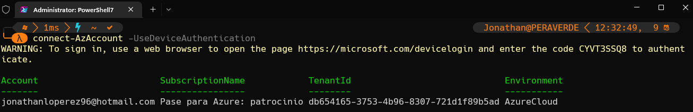

## 2 - Creación de recursos

Grupo de recursos
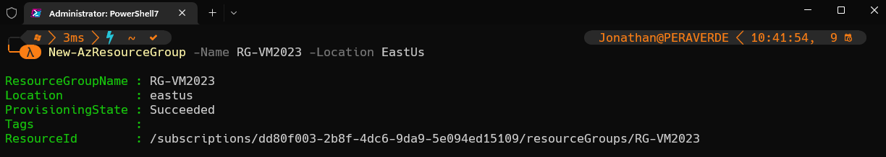
Ip pública
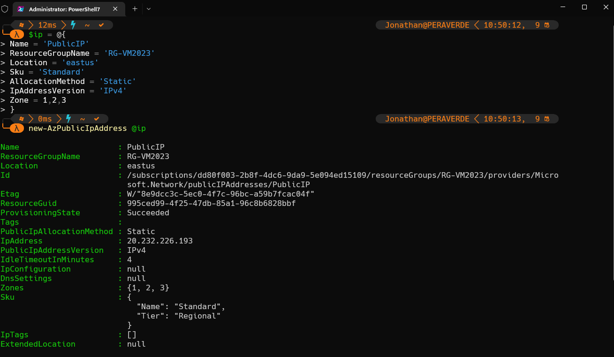
Máquina virtual
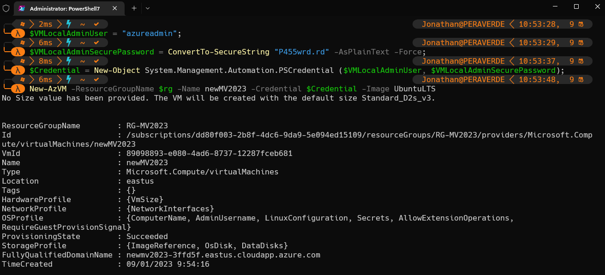
Interfaz
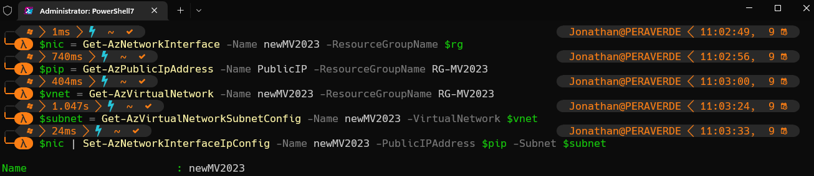
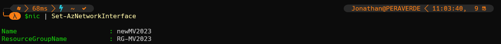
Nginx
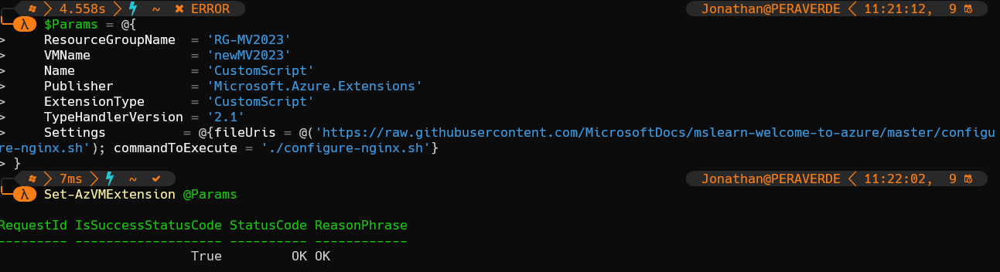

>> • Hay que habilitar en el firewall del recurso de grupos el puerto 80.

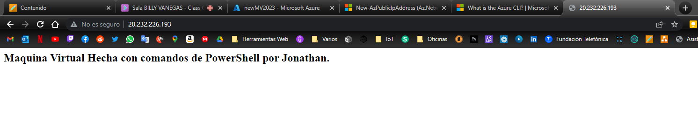

## AzureCli

## Creacion de recursos

Grupo de recursos
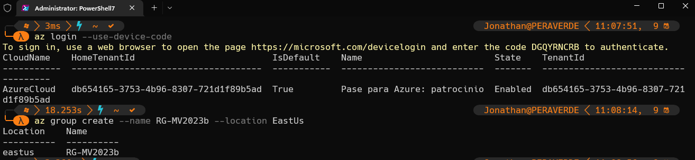
Maquina virtual
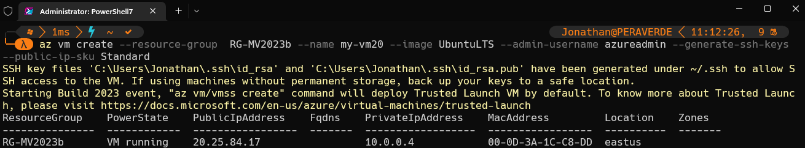

Nginx
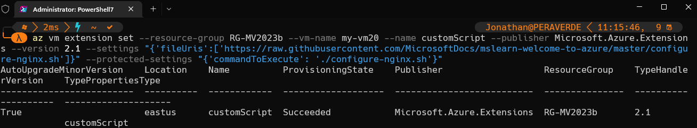

>> • Hay que habilitar en el firewall del recurso de grupos el puerto 80.

