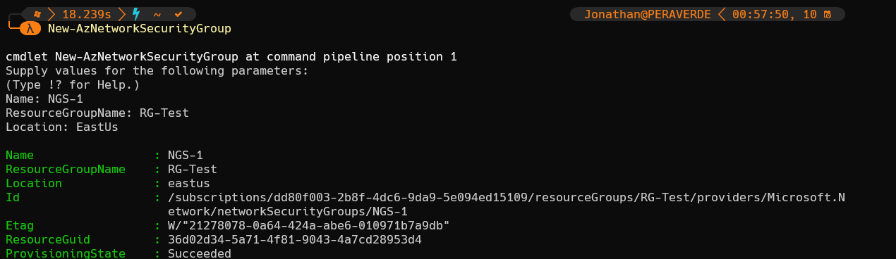
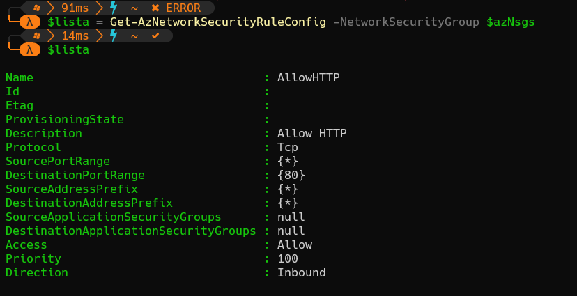

# EJERCICIO AZUREPowerShell & AZURECLI

## AzurePowerShell

## 1 - Conexión

Establecemos la conexión con nuestra cuenta de azure.

> Connect-AzAccount -UseDeviceAuthentication

## 2 - Creación de recursos

1- Creamos el grupo de recursos donde guardar todo lo relacionado con esta parte del ejercicio.

`$rg = RG-VM2023`

> New-AzResourceGroup -Name $rg -Location EastUs

2- Declaramos una IP pública para este grupo de recursos.

`$ip = @{Name = 'PublicIP' ResourceGroupName = $rg Location = 'eastus' Sku = 'Standard' AllocationMethod = 'Static' IpAddressVersion = 'IPv4' Zone = 1,2,3   }`

> New-AzPublicIpAddress @ip

3- Creamos la máquina virtual.

`$VMLocalAdminUser = "azureadmin";`  
`$VMLocalAdminSecurePassword = ConvertTo-SecureString "P455wrd.rd" -AsPlainText -Force;`  
`$Credential = New-Object System.Management.Automation.PSCredential ($VMLocalAdminUser, $VMLocalAdminSecurePassword);`

> New-AzVM -ResourceGroupName $rg -Name newMV2023 -Credential $Credential -Image UbuntuLTS

4- Creamos la interfaz de red para asignársela a la máquina virtual.

`$nic = Get-AzNetworkInterface -Name newMV2023 -ResourceGroupName $rg`  
`$pip = Get-AzPublicIpAddress -Name myPublicIP -ResourceGroupName $rg`  
`$vnet = Get-AzVirtualNetwork -Name newMV2023 -ResourceGroupName $rg`  
`$subnet = Get-AzVirtualNetworkSubnetConfig -Name newMV2023 -VirtualNetwork $vnet`

> $nic | Set-AzNetworkInterfaceIpConfig -Name newMV2023 -PublicIPAddress $pip -Subnet $subnet  
>$nic | Set-AzNetworkInterface

5- Instalamos el módulo Nginx que se encargará de ofrecer el servicio web.

`$Params = @{ ResourceGroupName  = $rg VMName             = 'newMV2023' Name               = 'CustomScript' Publisher          = 'Microsoft.Azure.Extensions' ExtensionType      = 'CustomScript' TypeHandlerVersion = '2.1' Settings          = @{fileUris = @('https://raw.githubusercontent.com/MicrosoftDocs/mslearn-welcome-to-azure/master/configure-nginx.sh'); commandToExecute = './configure-nginx.sh'} }`

> Set-AzVMExtension @Params

6- Comprobamos la IP pública y creamos las reglas de seguridad de red del recurso y las mostramos.

`$pip = Get-AzPublicIpAddress -Name myPublicIP -ResourceGroupName $rg`  
> $pip.IPAddress  
> New-AzNetworkSecurityGroup -Name NGS-1 -ResourceGroupName $rg -Location EastUs  
`$azNsgs = Get-AzNetworkSecurityGroup`  
> $lista = Get-AzNetworkSecurityRuleConfig -NetworkSecurityGroup $azNsgs

7- Añadimos la regla de entrada por el puerto 80 y hacemos update.

`Add-AzNetworkSecurityRuleConfig -Name AllowHTTP -NetworkSecurityGroup $azNsgs -Description "Allow HTTP" -Access Allow -Protocol Tcp -Direction Inbound -Priority 100 -SourceAddressPrefix * -SourcePortRange * -DestinationAddressPrefix * -DestinationPortRange 80`

> Set-AzNetworkSecurityGroup -NetworkSecurityGroup $azNsgs

> Podemos conectar a través de la consola serial en el portal de azure y editar el index.html, al entrar con la Ip pública debería mostrarlo.

## AzureCli

## Creación de recursos

1- Creamos el grupo de recursos donde guardar todo lo relacionado con esta parte del ejercicio.  
`az group create --name RG-MV2023b --location EastUs`

2- Creamos la máquina virtual.
`az vm create --resource-group  RG-MV2023b --name my-vm20 --image UbuntuLTS --admin-username azureadmin --generate-ssh-keys --public-ip-sku Standard`

3- Instalamos el módulo Nginx que se encargará de ofrecer el servicio web.  
`az vm extension set --resource-group RG-MV2023b --vm-name my-vm20 --name customScript --publisher Microsoft.Azure.Extensions --version 2.1 --settings "{'fileUris':['https://raw.githubusercontent.com/MicrosoftDocs/mslearn-welcome-to-azure/master/configure-nginx.sh']}" --protected-settings "{'commandToExecute': './configure-nginx.sh'}"`

4- Comprobamos IP pública y mostramos la reglas de seguridad.  

> $rg = "RG-MV2023"  
> $pip = Get-AzPublicIpAddress -Name myPublicIP -ResourceGroupName $rg  
> $pip.IPAddress  
> az network nsg list --resource-group RG-MV2023b --query '[].name' --output tsv

5- Creamos una nueva regla y mostramos.

`az network nsg rule create --resource-group RG-MV2023b --nsg-name my-vm20NSG --name allow-http --protocol tcp --priority 100 --destination-port-range 80 --access Allow`  

`az network nsg rule list --resource-group RG-MV2023b --nsg-name my-vm20NSG --query '[].{Name:name, Priority:priority, Port:destinationPortRange, Access:access}' --output table`

6- Accedemos a la página web.  

> curl --connect-timeout 5 <http://$IPADDRESS>

